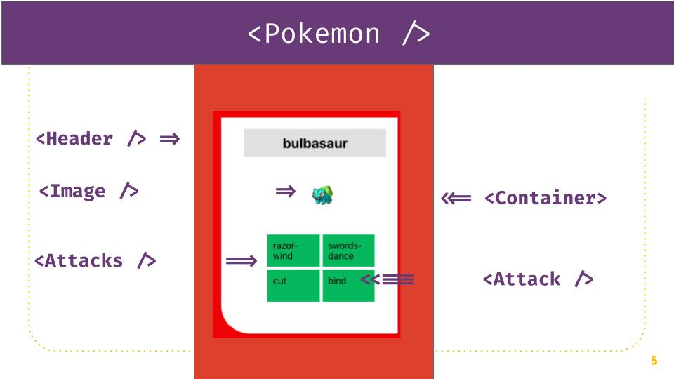

This project was bootstrapped with [Create React App](https://github.com/facebook/create-react-app).

## Este repositorio se usó para enseñar lo básico de styled-components

```bash
$ git clone https://github.com/behagoras/master-styled-components
```

Instala las librerías necesarios con

```bash
$ yarn install
$ yarn add styled-components
```

Para correr el proyecto

```bash
$ yarn start
```

El proyecto en la rama sesion tiene ya implementada la conexión a la api https://pokeapi.co así que podrás crearte usarlo sin preocuparte por el asincronismo.

## Los retos

1. Genera los estilos para el componente de [Pokemons](./src/components/Pokemons) en el que puedas generar un grid para que se vea en 4 columnas.
2. Genera los estilos para que se vea la tarjeta de cada [Pokemon](./src/components/Pokemon) 

## Reto resuelto

A continuación los estilos para que puedas ver el resultado.

### No te olvides de importar styled-components.

```javascript
import styled from 'styled-components'
```

### About.jsx

Acá podrías tu experimentar para hacer tus estilos en una página sencilla.

```javascript
const Container = styled.div`
  padding:20px;
  max-width:800px;
  margin:auto;
  background:#666;
`;

const Paragraph = styled.p`
  color:#123;
  font-family:monospace;
`;

const Title = styled.h2`
  color:#136;
`;
```

### Pokemons.jsx

El componente de Pokemons te puede ayudar a dar estilos al padre de las tarjetas de cada Pokemon.

Para eso, primero crea un componente que extienda de `div`

```javascript
const Container = styled.div``
```

Los estilos del componente son:

```javascript
const Container = styled.div`
  display:grid;
  grid-template-columns: repeat(auto-fit, minmax(250px, auto));
  padding:20px;
  grid-gap:50px;
  justify-items:center;
  background:#DD412D;
  max-width:100%;
`;
```

### Implementa tu componente

```javascript
const Pokemons = ({ data: pokemons }) => {
  return (
    <Container>
      {pokemons.map((pokemon) => (
        <Pokemon data={pokemon} />
      ))}
    </Container>
  );
};
```


## Pokemon.jsx



#### 1. Crea tus componentes

Siguiendo la estructura pasada, así que genérate los componentes necesarios:

```JavaScript
const Container = styled.div``
const Header = styled.h2``
const Image = styled.figure``
const Attacks = styled.ul``
const Attack = styled.ul``
```

#### 2. Genera los estilos

```javascript
const Container = styled.div`
  background:white;
  padding:0 40px 40px 40px;
  border-radius:0 0 0 50px;
`;
const Header = styled.h2`
  background:#E0E0E0;
  display:block;
  width:100%;
  position:relative;
  padding:10px;
  text-align:center;
`;


const Attacks = styled.ul`
  display: grid;
  grid-template-columns:1fr 1fr;
  grid-template-rows:1fr 1fr;
  list-style-type:none;
  grid-gap:5px;
`;

const Attack = styled.li`
  padding:10px;
  background:#52AE5E;
`;

const Image = styled.figure`
  width:auto;
  & img {
    margin-left:50px;
    text-align:center;
    display:inline;
  }
`;

```

### 3. Implementa los estilos

```javascript
const Pokemon = ({ data: pokemon }) => {
  console.log(pokemon);
  return (
    <Container>
      <Header>{pokemon.name}</Header>
      <Image>
        
      </Image>
      <Attacks>
        <Attack>{pokemon.moves[0].move.name}</Attack>
        <Attack>{pokemon.moves[1].move.name}</Attack>
        <Attack>{pokemon.moves[2].move.name}</Attack>
        <Attack>{pokemon.moves[3].move.name}</Attack>
      </Attacks>
    </Container>
  );
};
```

### Header.jsx

También puedes modificar un poco los estilos del Header.jsx

```javascript
const Container = styled.nav`
  display:flex;
  justify-content:center;
`;
const List = styled.ul`
  display:flex;
`;
const MenuElement = styled.li`
  list-style-type:none;
  margin:0 10px;

`;
const MyLink = styled(Link)`
  text-decoration:none;
  color: #1f1f1f;
  background:#ccc;
  padding:5px;
  border-radius:2px;
  box-shadow: 3px 3px 3px 0px rgba(0,0,0,0.3);
  &:hover {
    box-shadow: 3px 3px 3px 0px rgba(0,0,0,0.75);
  }
`;
```

